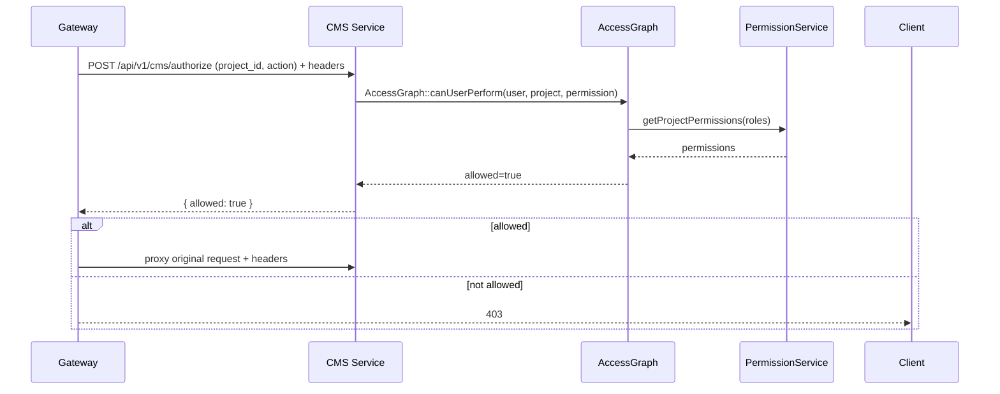

# Access Graph Model

## Purpose

This document defines the entity-based permissions model for the GD platform.
The access graph avoids hardcoded ownership checks by expressing authorization as relationships between entities.
It is the foundation for `PermissionService`, `project.access.granted`, `project.access.revoked`, and future platform modules.

## Core principles

- Authorization is derived from graph relationships, not from procedural `if owner then allow` logic.
- Entities are first-class nodes in the graph.
- Roles and permissions are inferred by traversing edges.
- Access changes are recorded as events and graph mutations.
- Tenant and order linkage are part of the same model.

## Entity types

- `User`
- `Project`
- `Order`
- `Tenant`
- `Role` (implicit/static node type for policy mapping)
- `Permission` (implicit/static mapping)
- `Event` / `TimelineEntry`
- `Notification`

## Relationship types (edges)

### User ↔ Project

- `CREATED_BY` (Project → User)
  - when a user creates a project
  - implies `project_owner`

- `COLLABORATOR` (Project → User)
  - explicit access grant to a non-owner user
  - implies `collaborator`

- `HAS_ROLE` (User → Project)
  - optional normalized form for role assignment
  - can carry a role label such as `project_owner`, `order_customer`, `collaborator`, `viewer`

- `ACCESS_GRANTED` / `ACCESS_REVOKED` (Event)
  - represent history of collaborator graph updates
  - provide audit trail and event-driven notifications

### Order ↔ Project

- `ORDER_PROJECT` (Order → Project)
  - links a service order to its project

### User ↔ Order

- `ORDER_CUSTOMER` (Order → User)
  - identifies the customer for the order
  - implies `order_customer` for the linked project

### User ↔ Tenant

- `MEMBER_OF` (User → Tenant)
  - tenant membership
  - implies `tenant_member` for tenant-scoped projects

### Project ↔ Tenant

- `BELONGS_TO` (Project → Tenant)
  - associates a project with a tenant boundary

## Derived roles

The graph derives these roles by following relationships:

- `admin`
  - explicit user role outside the project graph
  - bypasses regular graph traversal

- `project_owner`
  - derived from `CREATED_BY`

- `order_customer`
  - derived from `ORDER_CUSTOMER` + `ORDER_PROJECT`
  - also derived from `customer_id` stored on the project when order linkage exists

- `collaborator`
  - derived from `COLLABORATOR`

- `tenant_member`
  - derived when the user is `MEMBER_OF` the same tenant as the project

- `viewer`
  - derived from explicit access grant or tenant/organization policy
  - this is the least-privileged read-only role

## Permissions mapping

The graph separates role inference from permission grants.
`PermissionService` maps roles to permissions centrally.

Example permission mapping:

- `project_owner`
  - all project-level permissions

- `order_customer`
  - `project.read`
  - `project.upload`
  - `project.comment`
  - `chat.read`
  - `chat.send`
  - `forms.read`
  - `forms.submit`
  - `notification.read`
  - `notification.mark_read`
  - `vault.access`
  - `vault.upload`

- `collaborator`
  - `project.read`
  - `project.comment`
  - `chat.read`
  - `chat.send`
  - `forms.read`

- `tenant_member`
  - `project.read`

- `viewer`
  - `project.read`

## Permission evaluation

A permission check executes these steps:

1. Identify the subject: user or service principal.
2. Resolve the target entity: project, vault, chat, form, etc.
3. If the subject is `admin`, grant immediately.
4. Traverse the graph to infer roles:
   - `project_owner` via `CREATED_BY`
   - `order_customer` via `ORDER_CUSTOMER` and `ORDER_PROJECT`
   - `collaborator` via `COLLABORATOR`
   - `tenant_member` via shared tenant membership
5. Merge role permissions into an effective permission set.
6. Check the requested action against the normalized permission name.

This supports both direct action checks and endpoint-level authorization.

## Graph mutation events

The following events drive graph mutations:

- `project.created`
  - create `Project` node
  - add `CREATED_BY`
  - optionally add `ORDER_PROJECT` and `ORDER_CUSTOMER`

- `project.access.granted`
  - add `COLLABORATOR` edge
  - add `HAS_ROLE` with role `collaborator` if used

- `project.access.revoked`
  - remove `COLLABORATOR` edge

- `order.completed`
  - update `Order` node status
  - may create project or attach order metadata

- `file.uploaded`, `chat.message.sent`, `revision.requested`, `requirements.submitted`
  - these are timeline events that can also trigger notifications

## Exact graph data structure

The production-safe graph is stored as a normalized node/edge model with index-ready arrays.
The exact JSON shape is:

```json
{
  "nodes": {
    "project:123": {
      "id": "project:123",
      "type": "project",
      "data": {
        "uuid": "123",
        "tenant_id": "tenant:acme",
        "order_id": "order:abc",
        "customer_id": "user:customer1"
      }
    },
    "user:alice": {"id": "user:alice", "type": "user", "data": {"email": "alice@example.com"}},
    "order:abc": {"id": "order:abc", "type": "order", "data": {"status": "completed"}},
    "tenant:acme": {"id": "tenant:acme", "type": "tenant", "data": {"name": "Acme Co."}}
  },
  "edges": {
    "edge:1": {"id": "edge:1", "type": "CREATED_BY", "from": "project:123", "to": "user:alice", "meta": {"created_at": "..."}},
    "edge:2": {"id": "edge:2", "type": "ORDER_PROJECT", "from": "order:abc", "to": "project:123"},
    "edge:3": {"id": "edge:3", "type": "ORDER_CUSTOMER", "from": "order:abc", "to": "user:customer1"},
    "edge:4": {"id": "edge:4", "type": "COLLABORATOR", "from": "project:123", "to": "user:bob"},
    "edge:5": {"id": "edge:5", "type": "BELONGS_TO", "from": "project:123", "to": "tenant:acme"},
    "edge:6": {"id": "edge:6", "type": "MEMBER_OF", "from": "user:bob", "to": "tenant:acme"}
  }
}
```

This structure is production-safe because:

- It is normalized for fast node/edge lookup.
- It separates node semantics from relationship traversal.
- It supports incremental updates without schema changes.
- It can be persisted to a document store, relational store, or graph DB.

## Traversal algorithm

The graph resolution algorithm is intentionally shallow and deterministic.
It does not rely on arbitrary path expansion, and it validates edge types at every step.

### Role inference algorithm

1. Normalize the target IDs:
   - `projectNodeId = project:<projectId>`
   - `userNodeId = user:<userId>`
2. Load the graph structure.
3. Confirm the project node exists.
4. If the subject is an admin, return `['admin']` immediately.
5. Derive roles by inspecting concrete relationship patterns:
   - `project_owner` when `project -> CREATED_BY -> user`
   - `collaborator` when `project -> COLLABORATOR -> user`
   - `order_customer` when `project <- ORDER_PROJECT <- order -> ORDER_CUSTOMER -> user`
   - `tenant_member` when `project -> BELONGS_TO -> tenant` and `user -> MEMBER_OF -> same tenant`
6. Return unique roles.

### Exact traversal pseudocode

```php
function resolveProjectRoles(string $userId, string $projectId, ?string $tenantId = null, bool $isAdmin = false): array
{
    if ($isAdmin) {
        return ['admin'];
    }

    $graph = AccessGraph::loadGraph();
    $project = AccessGraph::getNode($graph, "project:$projectId");
    if (!$project) {
        return [];
    }

    $userNodeId = "user:$userId";
    $roles = [];

    if (AccessGraph::hasDirectEdge($graph, "project:$projectId", $userNodeId, 'CREATED_BY')) {
        $roles[] = 'project_owner';
    }

    if (AccessGraph::hasDirectEdge($graph, "project:$projectId", $userNodeId, 'COLLABORATOR')) {
        $roles[] = 'collaborator';
    }

    if (AccessGraph::matchesOrderCustomer($graph, "project:$projectId", $userNodeId)) {
        $roles[] = 'order_customer';
    }

    if (AccessGraph::matchesTenantMember($graph, "project:$projectId", $userNodeId, $tenantId)) {
        $roles[] = 'tenant_member';
    }

    return array_values(array_unique($roles));
}
```

### Production-safe traversal details

- Use explicit edge types, not wildcard traversal.
- Use an upper bound on permitted hops (for this model, 8 is safe).
- Reject unknown node or edge types.
- Use stable identifiers (`user:uuid`, `project:uuid`, etc.).
- Persist both nodes and edges so condition checks can be cached and indexed.
- Avoid permission logic embedded in traversal; return roles only.
- Map roles to permissions in a separate service layer.

## Permission check flow

1. Resolve the user roles for the target project from the graph.
2. Merge role permissions with the policy map.
3. Check the requested permission against the effective set.

This separation makes the graph algorithm production-safe and auditable.

## Integration note

The exact traversal implementation is captured in `services/lib/AccessGraph.php`.
It can be used by `PermissionService` for authorization and by event handlers for access graph mutations.

## Implementation guidance

- Keep `PermissionService` as the canonical authorization engine.
- Let CMS endpoints call the service with normalized actions.
- Treat explicit access grants as updates to graph edges, not as special-case branch logic.
- Persist relationship metadata on order/project nodes, but derive roles through the graph.
- Emit `project.access.granted` and `project.access.revoked` when the graph changes.
- Build future modules on the same graph vocabulary so notifications, audit, analytics, and policy enforcement all agree.

## Middleware Integration

Gateways and services should use the access graph via a small preflight/authorization API or a middleware helper.

- The recommended pattern for Gateways is to call `POST /api/v1/cms/authorize` as a preflight for write-sensitive endpoints and forward the headers `X-User-Id`, `X-User-Roles`, and `X-Tenant-Id`.
- Services that sit behind the Gateway should also enforce authorization by calling the local middleware helper `AccessGraphMiddleware::authorizeFromHeaders(projectId, action)` when headers are present.

Example sequence (Gateway preflight + service enforcement):



Implementation notes:

- Keep the middleware small and deterministic: it should return allowed/denied and the effective permissions when requested.
- In high-traffic environments, add a short-lived cache for authorization results and invalidate on graph mutation events (`project.access.granted` / `project.access.revoked`).
