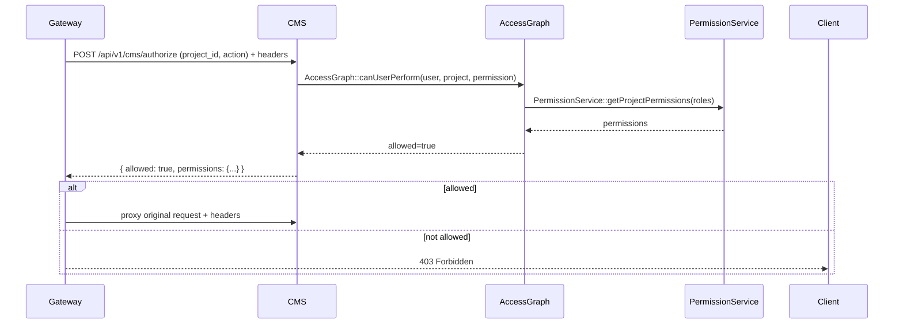

# Platform Service Specification

## Purpose

This document defines the platform policy layer that the CMS service consumes. The CMS should not hardcode business policy; it should implement service contracts and enforce platform capabilities.

## Roles

- `admin`
  - Full platform authority
  - Manages all projects, users, and tenant scope

- `project_owner`
  - The creator/owner of a specific project
  - Full control over their project and associated workflows

- `order_customer`
  - The customer associated with a service order for a project
  - Can read project details, upload files, submit forms, and receive notifications

- `collaborator`
  - A user explicitly granted access to a project
  - Can read project data and participate in chat/comment workflows

- `tenant_member`
  - A user scoped by tenant membership
  - Can read tenant-owned projects where tenant membership is trusted

- `viewer`
  - Read-only consumer of project data within permitted scope

## Permissions

### Project Permissions

- `project.read`
- `project.write`
- `project.delete`
- `project.manage`
- `project.upload`
- `project.comment`
- `project.view`

### Chat Permissions

- `chat.read`
- `chat.send`

### Vault Permissions

- `vault.access`
- `vault.upload`
- `vault.delete`

### Form Permissions

- `forms.read`
- `forms.submit`

### Notification Permissions

- `notification.read`
- `notification.mark_read`

### Order Permissions

- `order.project.create`
- `order.project.link`

## Permission Inheritance

- `admin` inherits all permissions
- `project_owner` inherits all project and collaboration permissions for their project
- `order_customer` inherits read/comment/upload/form/notification permissions for their linked project
- `collaborator` inherits read/comment permissions for assigned projects
- `tenant_member` inherits read permissions within tenant scope
- `viewer` gets read-only access when explicitly allowed

## Access Graph Model

The platform uses an entity-based access graph to derive permissions from relationships between users, projects, orders, and tenants.
See `ACCESS_GRAPH_MODEL.md` for the full design of node types, relationship edges, role inference, and graph-driven permission evaluation.

## Event Taxonomy

### Project events
- `project.created`
- `project.updated`
- `project.status_changed`
- `project.archived`
- `project.deleted`

### File events
- `file.uploaded`
- `file.deleted`
- `file.version.created`

### Chat events
- `chat.message.sent`
- `chat.message.deleted`

### Workflow events
- `revision.requested`
- `revision.approved`
- `revision.rejected`
- `requirements.submitted`
- `project.access.granted`
- `project.access.revoked`

### Order events
- `order.completed`

### Notification events
- `notification.created`
- `notification.read`
- `notification.dismissed`

## CMS / future module alignment

The CMS implementation should emit the canonical event names above where applicable. Currently the CMS supports the following event names in its timeline and event API:

- `project.created`
- `project.updated`
- `project.status_changed`
- `file.uploaded`
- `chat.message.sent`
- `revision.requested`
- `requirements.submitted`

Planned future alignment targets:

- `project.archived`
- `project.deleted`
- `file.deleted`
- `file.version.created`
- `chat.message.deleted`
- `revision.approved`
- `revision.rejected`
- `notification.created`
- `notification.read`
- `notification.dismissed`

## Endpoint contract matrix

| Endpoint | Permission required | Canonical event emitted | Timeline / audit | Notification behavior |
|---|---|---|---|---|
| `POST /api/v1/cms/projects` | `project.write` | `project.created` | Yes | Optional / not auto-generated in current CMS implementation |
| `POST /api/v1/cms/projects/{id}/access/grant` | `project.manage` | `project.access.granted` | Yes | Optional notification support |
| `POST /api/v1/cms/projects/{id}/access/revoke` | `project.manage` | `project.access.revoked` | Yes | Optional notification support |
| `POST /api/v1/cms/projects/{id}/upload` | `project.upload` | `file.uploaded` | Yes | No current notification on project upload |
| `POST /api/v1/cms/vault/{id}/upload` | `vault.upload` | `file.uploaded` | Yes | Yes, triggers notification for order customer when uploader is not the customer |
| `POST /api/v1/cms/chat/{id}/send` | `chat.send` | `chat.message.sent` | Yes | Yes, triggers notification for order customer when sender is not the customer |
| `POST /api/v1/cms/forms/{id}/revision-request` | `forms.submit` / `project.write` | `revision.requested` | Yes | No current notification auto-generated |
| `POST /api/v1/cms/forms/{id}/requirements` | `forms.submit` / `project.write` | `requirements.submitted` | Yes | No current notification auto-generated |
| `POST /api/v1/cms/events` | Authorization depends on event/operation | Any canonical event | Yes | Depends on event and implementation |
| `POST /api/v1/cms/notifications/trigger` | `notification.mark_read`? or service-level trigger | `notification.created` semantic | No timeline event by default | Yes, creates notification record |
| `POST /api/v1/cms/notifications/{id}/mark-read` | `notification.mark_read` | `notification.read` semantic | No | Updates notification state |

> Note: The CMS currently stores notifications with legacy underscore-based notification types such as `project_created`, `file_uploaded`, `message_received`, `revision_requested`, and `requirements_submitted`. Future modules should normalize to canonical notification event names and/or map them consistently from legacy notification payloads.

## Notification Catalog

- `project_created`
  - Trigger: project created from order or manually
  - Audience: order customer
  - Channel: in-app (and optionally email)

- `project_updated`
  - Trigger: project updated
  - Audience: order customer
  - Channel: in-app (and optionally email)

- `file_uploaded`
  - Trigger: new file uploaded to project or vault
  - Audience: order customer
  - Channel: in-app

- `message_received`
  - Trigger: new chat message sent by staff or team member
  - Audience: order customer when sender is not the customer
  - Channel: in-app

- `revision_requested`
  - Trigger: revision request submitted
  - Audience: project owner or order customer depending on workflow
  - Channel: in-app

- `requirements_submitted`
  - Trigger: requirements submitted
  - Audience: project owner or order customer depending on workflow
  - Channel: in-app

## Validation Catalog

- Allowed MIME types for project file uploads
- Allowed MIME types for vault uploads
- Maximum project upload size: 10 MB
- Maximum vault upload size: 50 MB
- Message content must not be empty
- Revision request requires title and description
- Requirements submission requires requirements text
- Files Vault access requires an active license
- Projects must belong to a tenant

## Tenant Behavior

- Projects are tenant-scoped via `tenant_id`
- Tenant scope is passed through `X-Tenant-Id` or request payload
- Tenant members may only read projects within their tenant unless higher permissions exist
- Tenant isolation is enforced at endpoint boundaries
- Project ownership and order linkage override tenant membership when determining access

## Endpoint Contracts

### Authorization

`POST /api/v1/cms/authorize`

Request:
```json
{
  "project_id": "<project_id>",
  "action": "read|write|upload|comment|manage"
}
```

Response:
```json
{
  "allowed": true,
  "permissions": {
    "project.read": true,
    "project.write": false,
    ...
  }
}
```

### File Validation

`POST /api/v1/cms/validate-file`

Request:
```json
{
  "context": "project|vault",
  "file_name": "...",
  "file_size": 12345,
  "mime_type": "application/pdf"
}
```

Response:
```json
{
  "valid": true
}
```

### Event Logging

`POST /api/v1/cms/events`

Request:
```json
{
  "project_id": "...",
  "event_type": "project.created",
  "message": "Project created from order.",
  "metadata": {}
}
```

Response:
```json
{
  "event": { ... }
}
```

### Notification Trigger

`POST /api/v1/cms/notifications/trigger`

Request:
```json
{
  "user_id": "...",
  "type": "file_uploaded",
  "project_id": "...",
  "payload": {}
}
```

Response:
```json
{
  "notification": { ... }
}
```

### Order-Driven Project Creation

`POST /api/v1/cms/orders/create-project`

Request:
```json
{
  "id": "<order_id>",
  "created_by": "<user_id>",
  "customer_id": "<user_id>",
  "title": "Service Project - Order #123",
  "tenant_id": "<tenant_id>",
  "items": [ ... ]
}
```

Response:
```json
{
  "project_id": "..."
}
```

### Project CRUD

`GET /api/v1/cms/projects`
`GET /api/v1/cms/projects/{id}`
`POST /api/v1/cms/projects`

### Project Timeline

`GET /api/v1/cms/projects/{id}/timeline`
`POST /api/v1/cms/projects/{id}/timeline`

### Chat

`GET /api/v1/cms/chat/{project_id}/messages`
`POST /api/v1/cms/chat/{project_id}/send`

### Vault

`GET /api/v1/cms/vault/{project_id}/files`
`POST /api/v1/cms/vault/{project_id}/upload`
`DELETE /api/v1/cms/vault/{file_id}/delete`

### Notifications

`GET /api/v1/cms/notifications`
`POST /api/v1/cms/notifications/{id}/mark-read`

### Forms

`POST /api/v1/cms/forms/{project_id}/revision-request`
`POST /api/v1/cms/forms/{project_id}/requirements`
`GET /api/v1/cms/forms/{project_id}/submissions`

## Consistency Review

- The CMS must consume these platform service contracts and enforce them.
- Business policy is defined by roles, permissions, events, and tenant behavior.
- The CMS implements endpoint enforcement, not the global policy engine.
- Order/customer/project linkage is a platform capability, not a CMS-only rule.
- Tenant isolation is explicit and must be applied at request boundaries.

## Gateway Middleware Integration

This section describes how the API Gateway (or any fronting proxy) should perform preflight authorization checks and propagate identity/tenant context to the CMS service.

- **Preflight**: For any write or sensitive endpoint, the Gateway SHOULD call `POST /api/v1/cms/authorize` with `project_id` and `action` before proxying the request. The Gateway MUST forward these headers: `X-User-Id`, `X-User-Roles`, `X-Tenant-Id`.
- **Short-circuit**: If the `authorize` response contains `{"allowed": false}`, the Gateway SHOULD return `403 Forbidden` without proxying the request to the CMS.
- **Header propagation**: When proxying requests to the CMS, include `X-User-Id`, `X-User-Roles`, and `X-Tenant-Id` so service-level enforcement (middleware) can re-check or audit the request.

Example request (Gateway -> CMS preflight):

Request:
```
POST /api/v1/cms/authorize
Headers: X-User-Id, X-User-Roles, X-Tenant-Id
Body: { "project_id": "<project>", "action": "upload" }
```

Response:
```
{ "allowed": true, "permissions": { "project.read": true, "project.upload": true, ... } }
```

Mermaid sequence (Gateway preflight + proxy):



Notes:

- The Gateway MAY cache the `authorize` result for a short TTL (e.g., 5–30s) to reduce load on the CMS/AccessGraph, but caches must be invalidated on graph mutations (access grant/revoke) where possible.
- If the Gateway can access the platform graph or a shared policy API directly, it may perform the check itself instead of calling `/authorize`.
